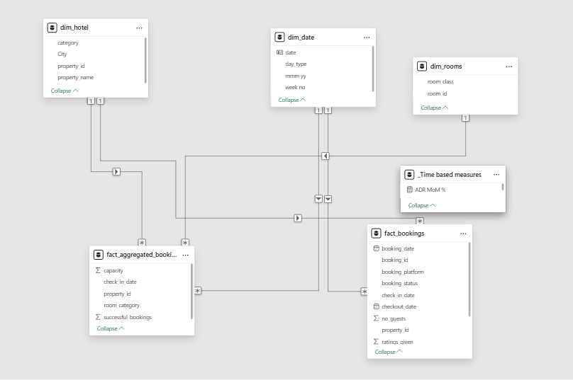

# Kaya Hotel Revenue Analysis (Power BI)


A comprehensive **Power BI** project that analyses the revenue performance of Kaya Hotel.  The report highlights key metrics such as room revenue, ADR, RevPAR, occupancy, seasonality trends, and booking lead-times, helping management make data-driven decisions.

---

## 📂 Project Structure

| Path | Description |
|------|-------------|
| `kaya_hotel_Page1.pbix` | Main Power BI file containing all visuals & measures |
| `kaya hotel report.PNG` | High-resolution screenshot of the final dashboard |
| `kaya_model.PNG` | Screenshot of the data-model schema |
| `kaya hotel revenue analysis data.rar` | Compressed raw dataset (CSV / Excel inside) |


## ✨ Key Insights & KPIs

| KPI | Measure |
|-----|---------|
| **Total Revenue** | Overall hotel revenue during selected period |
| **Average Daily Rate (ADR)** | Avg price paid per occupied room |
| **RevPAR** | Revenue per available room |
| **Occupancy %** | Rooms sold vs rooms available |
| **YoY / MoM Growth** | Compares performance across time |

Additional visuals include:

* Booking lead-time distribution  
* Segmentation by market (Corporate, OTA, Direct, etc.)  
* Seasonality & trend decomposition  
* Top performing room types & channels



---

## 🛠️ How to Use

1. **Prerequisite:** Install [Power BI Desktop](https://powerbi.microsoft.com/desktop/).
2. Clone the repository and open `kaya_hotel_Page1.pbix` in Power BI Desktop.
3. If prompted for credentials, choose *"Load without applying query changes"* (data is embedded).
4. Interact with slicers (Date, Market Segment, Room Type) to explore the data.
5. Modify or extend the model / visuals as needed.

---

## ⚙️ Data Model

The model consists of **fact** tables for reservations & revenue linked to **dimension** tables such as Date, Market Segment, and Room Type.  All relationships are *single-directional* to maintain star-schema integrity.

---

## 🚀 Getting Started Locally

```bash
# clone
> git clone https://github.com/<your-username>/kaya-hotel-revenue-analysis-PowerBI.git
> cd kaya-hotel-revenue-analysis-PowerBI

# open the PBIX file
> start kaya_hotel_Page1.pbix  # windows
```

---

## 🤝 Contributing

Pull requests are welcome!  For major changes, please open an issue first to discuss what you would like to change.

---

## 📄 License

This project is licensed under the MIT License – see the [LICENSE](LICENSE) file for details.

---

> © 2025 Kaya Hotel Analytics Team – Crafted with 💛 & Power BI
